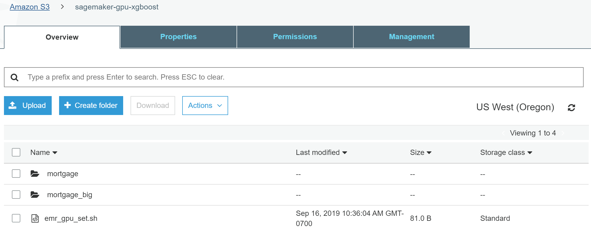
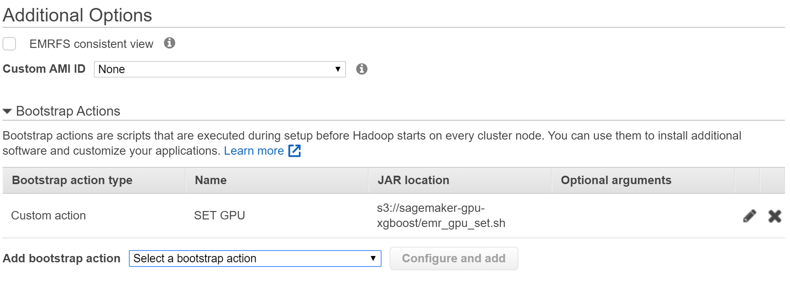

# Multi-GPU Configuration for XGBoost4J-Spark

This is an advanced guide on how to configure multiple GPUs to run XGBoost4j-Spark applications for each Spark workers.

### General Rules

As a general rule, the number of Spark executors must less than or equal to the number of GPUs on each host. I.e., each XGBoost Spark task should run on one GPU exclusively.

To enable this feature, *EXCLUSIVE_PROCESS* must be set for all GPUs for each host:

```
nvidia-smi -i [gpu index] -c EXCLUSIVE_PROCESS
```

For example:

```
nvidia-smi -i 0 -c EXCLUSIVE_PROCESS
```

sets *EXCLUSIVE_PROCESS* for GPU *0*.

### Configuration for On-Premises Clusters

To set the *EXCLUSIVE_PROCESS* for an on-promises cluster, please run the above *nvidia-smi* command for each GPU on each host before setting up the cluster. These commands might be added to a bootstrap script.

### Configuration for Cloud Service Providers (CSP)

Each CSP has its own way to run a bootstrap script. Here just need to put the above *nvidia-smi* commands to a bootstrap script to set the *EXCLUSIVE_PROCESS* mode for all GPUs.

Below is an example on how to set *EXCLUSIVE_PROCESS*  for AWS EMR:

- Create cluster and select  "go to advanced options".
- At  "Step 3:  General Cluster Settings", add Bootstrap to setup GPU exclusive mode.
  
    - Create a shell script file and upload to S3  (emr_gpu_set.sh).
      ```
      #!/bin/bash
      sudo nvidia-smi -i 0 -c EXCLUSIVE_PROCESS
      # set exclusive mode for other GPUs
      ```
      
    - In "Additional Options", select "Custom Action" to add a bootstrap action, select from S3 location and selec the script file (emr_gpu_set.sh). The script will be executed when EMR launches each instance.
      
