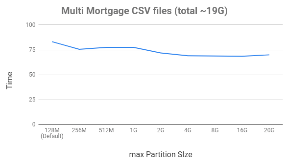

# Performance tuning for XGBoost4J-Spark

This is an advanced guide on how to tune chunk size to achieve best performance.

## Chunk size

We've supported chunk size reading and DMatrix building incrementally from version 0.2 release, and we also move DMatrix from GPU to CPU, which means XGBoost can load **any dataset size** if CPU memory is enough by tuning chunk size.

Currently, Chunk size is controlled by three values: file size, max partition size and maxRowsPerChunk.

- maxRowsPerChunk

The granulity of maxRowsPerChunk is measured by row, which default to Integer.MAX_VALUE. According to maxRowsPerChunk, we can hardly evaluate the size of total maxRowsPerChunk rows. So for this reason, We'd suggest **not to touch this value**, just keep its default value.

- max partition size

max partition size is controlled by `spark.sql.files.maxPartitionBytes`, Please refer to [this page](https://spark.apache.org/docs/latest/sql-performance-tuning.html)

After maxRowsPerChunk skipped, chunk size is equal to min{file size, max partition size}

### Benchmark

We have some rounds of benchmark test against max partition size

Given below files
```
1.6G        2010_1.csv
1.6G        2010_2.csv
1.5G        2010_3.csv
1.3G        2010_4.csv
2.6G        2011_1.csv
1.3G        2011_2.csv
1.5G        2011_3.csv
2.8G        2011_4.csv
970M        2014_1.csv
822M        2016_1.csv
963M        2016_2.csv
978M        2016_3.csv
887M        2016_4.csv
19G        total
```



From that, we can see, when max partition size is greater than the largest file size, it can achieve best performance.

However, There is a peak memory limitation when building DMatrix for a single chunk size, which should be less than TOTAL_GPU_MEMORY/3

> In summary, when each file size is equal to max partition size, and max partition size is configured to TOTAL_GPU_MEMORY/3, then XGBoost can achieve the best performance.

### How to use

You can configure max parititon size when you submit your task.

```
spark-submit --conf spark.sql.files.maxPartitionBytes=XXXXXXX
```
