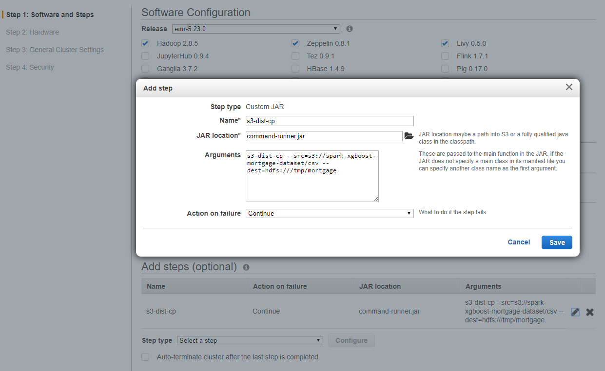

# Advanced Topic: Using Large Mortgage Dataset for AWS EMR XGBOOST4J-SPARK 


This guide adds some additional instructions and tips for running large Mortgage datasets on XGBoost4J-Spark on AWS EMR. Please use this quick start guide - [Get Started with XGBoost4J-Spark on AWS EMR](emr.md) for complete step-by-step instructions to run GPU XGBoost Mortgage Examples.

#### Use Multi-GPU P3 instance for AWS EMR Core Nodes

For large datasets, we recommend to use two P3.8xlarge instances as Core node, which has total 8 GPUs.
Please also increase the EBS storage on each Core node to 300G if using HDFS to store the data.

Please also ssh into each Core node to issue following command to set *EXCLUSIVE_PROCESS*  for all GPUs on each Core node.
This step is explained in [Multi-GPU Configuration for XGBoost4J-Spark](/advanced-topics/multi-gpu.md) The public IP address of each core node can be found by clicking EMR Cluster Details. Go to Hardware tab and click the ID of Core. 
You can use the same private key and username *hadoop* to log into each node. The bootstrap function in EMR currently doesn't support this script.

```
nvidia-smi -c EXCLUSIVE_PROCESS 
```

#### Using Full Mortgage Datasets for Mortgage Example 

##### Option 1: Using EMR steps to copy full Mortgage datasets to HDFS  

You can copy the full [mortgage data](https://rapidsai.github.io/demos/datasets/mortgage-data) to HDFS in EMR Master Node.  
Or Load the dataset from S3 when launch the AWS EMR cluster using steps

In step 1: Software and Steps, add a step with Name, JAR location (command-runner.jar) and the following command in arguments. 
```
s3-dist-cp --src=s3://spark-xgboost-mortgage-dataset/csv --dest=hdfs:///tmp/mortgage
```




##### Option 2: Using AWS S3 for Datasets Directly  
You can use dataseta on S3 directly when submit the spark job.
Please refer to this [AWS document](https://docs.aws.amazon.com/emr/latest/ManagementGuide/emr-plan-file-systems.html) for detailed information.
In our example, you can use following the format: 
```
export DATA_PREFIX=s3://spark-xgboost-mortgage-dataset/csv
```


#### Run Mortgage Example with Full Datasets with 1000 rounds and 20 depth
The same jar file built in [quick start guide](emr.md) will be used here. 
Now here is how to run the GPU Mortgage Example with full Mortgage Datasets for 1000 rounds and 20 depth:

```
export SPARK_DEPLOY_MODE=cluster
export JARS_PATH=hdfs:/tmp/xgboost4j_spark/
export SPARK_DRIVER_MEMORY=10G
export SPARK_EXECUTOR_MEMORY=40G	
export SPARK_NUM_EXECUTORS=8	
export CORES_PER_EXECUTOR=6	
export TOTAL_CORES=$((${CORES_PER_EXECUTOR}*${SPARK_NUM_EXECUTORS}))	
export JAR_PREFIX=hdfs:/tmp/xgboost4j_spark/
export EXAMPLE_CLASS=ai.rapids.spark.examples.mortgage.GPUMain
export JAR_EXAMPLE=${JARS_PATH}/sample_xgboost_apps-0.1.4-jar-with-dependencies.jar

export DATA_PREFIX=hdfs:/tmp/mortgage
//export DATA_PREFIX=s3://spark-xgboost-mortgage-dataset/csv for s3 storage
export TRAIN_DATA=${DATA_PREFIX}/train/20*	
export EVAL_DATA=${DATA_PREFIX}/eval/20*	
	
export ROUND=100
export TREE_METHOD=gpu_hist	

spark-submit  \
--master yarn \
--deploy-mode ${SPARK_DEPLOY_MODE} \
--driver-memory ${SPARK_DRIVER_MEMORY} \
--executor-memory ${SPARK_EXECUTOR_MEMORY} \
--conf spark.executor.cores=${CORES_PER_EXECUTOR} \
--conf spark.task.cpus=${CORES_PER_EXECUTOR} \
--conf spark.yarn.maxAppAttempts=1 \
--conf spark.sql.files.maxPartitionBytes=4294967296 \
--num-executors ${SPARK_NUM_EXECUTORS} \
--class ${EXAMPLE_CLASS} \
${JAR_EXAMPLE} \
-trainDataPath=$TRAIN_DATA \
-evalDataPath=$EVAL_DATA \
-format=csv \
-numRound=$ROUND \
-max_depth=20 \
-num_workers=${SPARK_NUM_EXECUTORS} \
-treeMethod=${TREE_METHOD}      \
-nthread=${CORES_PER_EXECUTOR}	
```

In the stdout driver log, you should see timings\* (in seconds), and the RMSE accuracy metric.  To find the stdout, go to the details of cluster, select Application history tab, and then click the application you just ran, click Executors tab, in the driver row, click "view logs" and then click "stdout".  The stdout log file will show all the outputs.

------ Training ------

Tracker started, with env={DMLC_NUM_SERVER=0, DMLC_TRACKER_URI=172.31.25.254, DMLC_TRACKER_PORT=9091, DMLC_NUM_WORKER=8}

==> Benchmark: Elapsed time for [Mortgage GPU train csv stub Unknown Unknown Unknown]: 785.183s

------ Transforming ------

==> Benchmark: Elapsed time for [Mortgage GPU transform csv stub Unknown Unknown Unknown]: 383.537s

------Accuracy of Evaluation------

==> Benchmark: Accuracy for [Mortgage GPU Accuracy csv stub Unknown Unknown Unknown]: 0.9909487814701571
