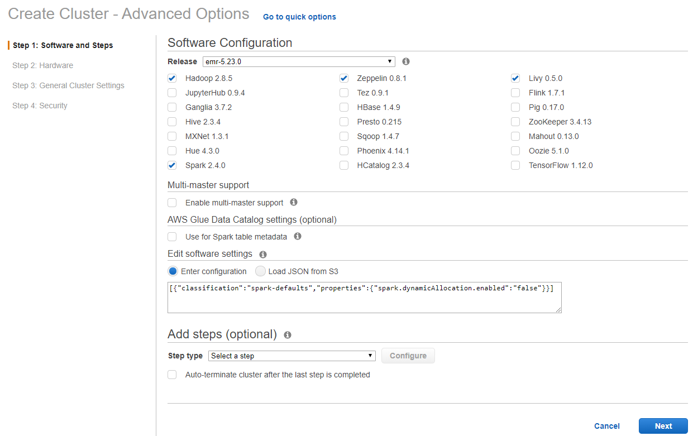
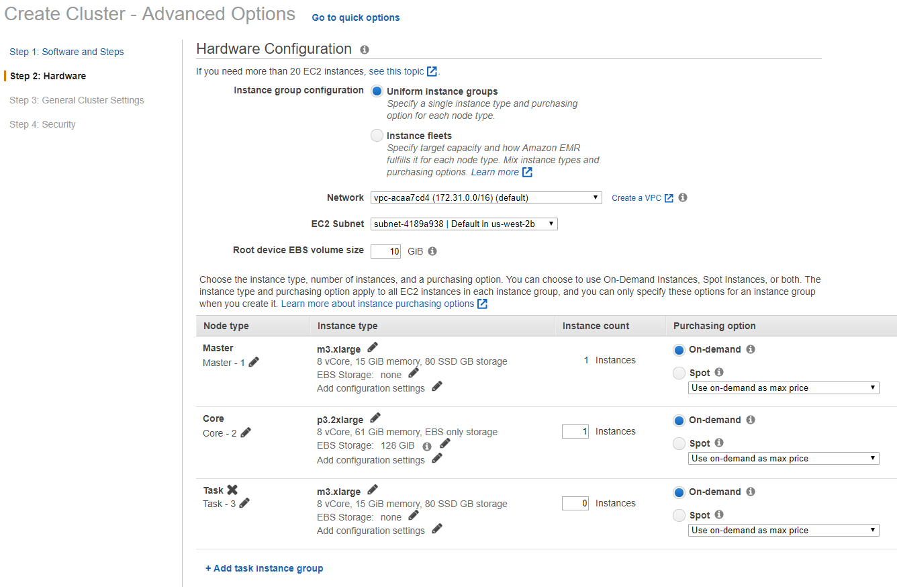
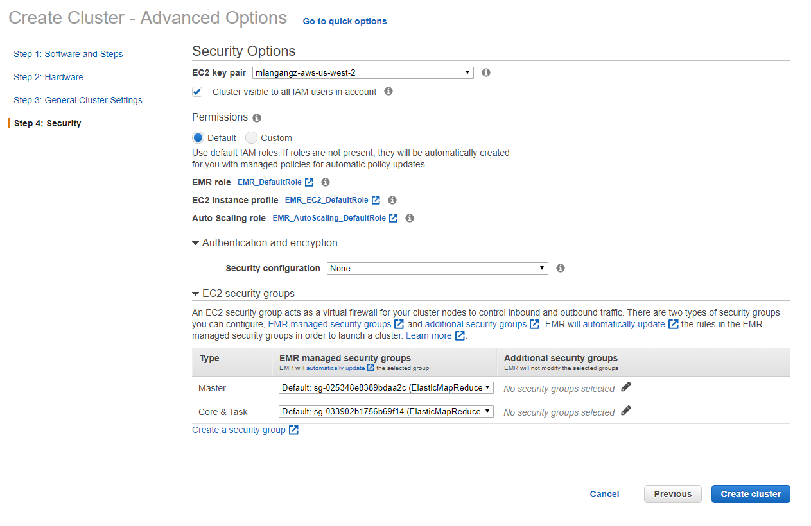
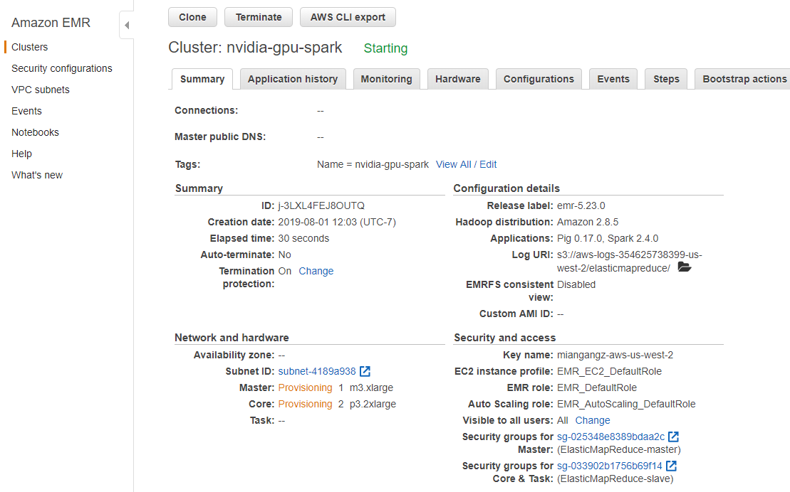
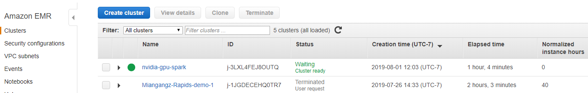
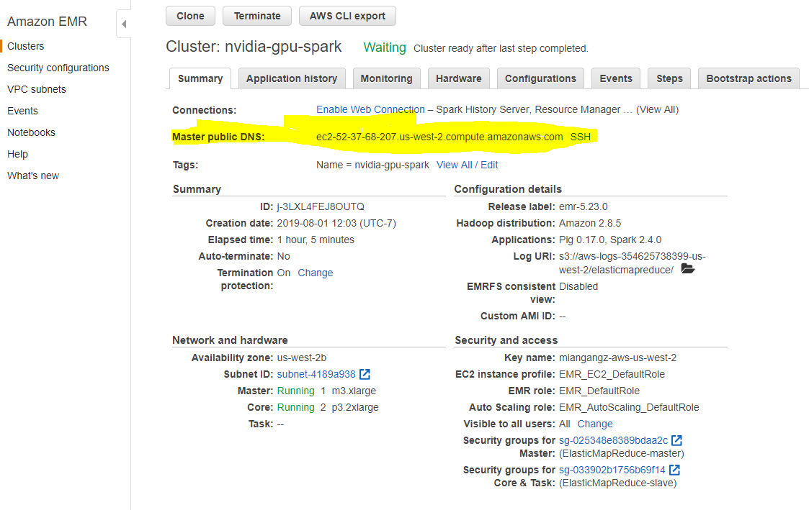
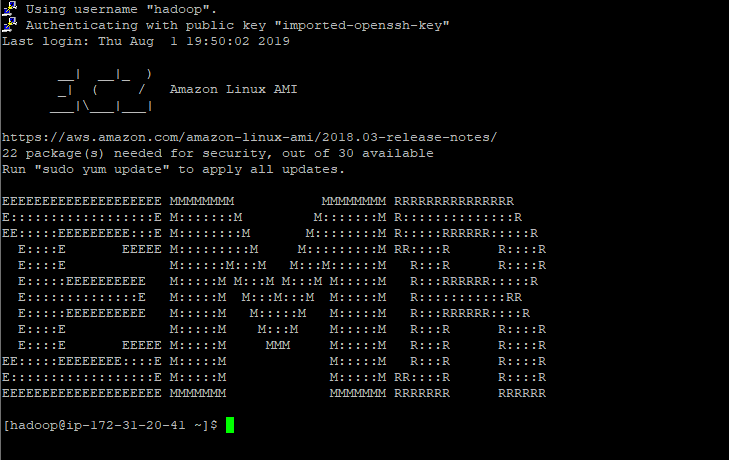
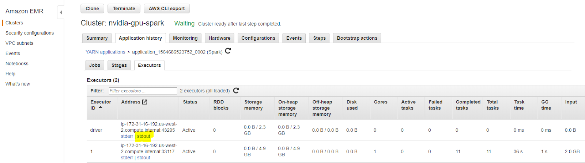

# Get Started with XGBoost4J-Spark on AWS EMR

This is a getting started guide to XGBoost4J-Spark on AWS EMR. At the end of this guide, the reader will be able to run a sample Apache Spark application that runs on NVIDIA GPUs on AWS EMR.

For more details of AWS EMR and get started, please check the [AWS document](https://docs.aws.amazon.com/emr/latest/ManagementGuide/emr-what-is-emr.html).

### Configure and Launch AWS EMR with GPU Nodes

Go to AWS Management Console and click EMR service and select a region, e.g. Oregon. Click Create cluster and select  "go to advanced options", which will bring up a detailed cluster configuration page.

###### Step 1:  Software and Steps

Select emr-5.23.0 release, uncheck all the software versions, and then check Hadoop 2.8.5 and Spark 2.4.0.



###### Step 2: Hardware

Select the right VPC for network and the availability zone for EC2 subnet.

In node type,  keep the m3.xlarge for Master node and change the Core node type to p3.2xlarge with 1 or multiple instance.  No need for Task node.



###### Step 3:  General Cluster Settings

Input cluster name and key names (optional) for the EMR cluster.

Also keep a note for the s3 bucket name configured.  You can also add your custom AMI or Bootstrap Actions here.


######  Step 4: Security

Pick your own EC2 key pair for SSH access. You can use all the default roles and security groups.   For security groups, you may need to open SSH access for Master node. And click "Create cluster" to complete the whole process.



###### Finish the Configuration

The management page will show the details of the cluster and the nodes are being provisioned.



Cluster will show "Waiting, cluster ready" when it is full provisioned.



Click the details of cluster and find the Master public DNS. Use this DNS address to ssh into with the corresponding EC2 private key. The username is hadoop.





### Launch XGBoost-Spark examples on EMR

Last, let's follow this guide [Get Started with XGBoost4J-Spark on Apache Hadoop YARN](/getting-started-guides/on-premises-cluster/yarn-scala.md) to run the example with data on Spark.

First get application jar and dataset:

```
mkdir jars
mkdir data
cp target/*.jar jars/
cd data
wget https://rapidsai-data.s3.us-east-2.amazonaws.com/spark/mortgage.zip
unzip mortgage.zip
cd ..
```

Then copy local data and jar to HDFS:

```
hadoop fs -mkdir /tmp/xgboost4j_spark
hadoop fs -copyFromLocal * /tmp/xgboost4j_spark
```

Now Launch the GPU Mortgage Example:

```
# location where data was downloaded
export DATA_PATH=hdfs:/tmp/xgboost4j_spark/data
# location for the required jar
export JARS_PATH=hdfs:/tmp/xgboost4j_spark/jars
# spark deploy mode (see Apache Spark documentation for more information)
export SPARK_DEPLOY_MODE=cluster
# run a single executor for this example to limit the number of spark tasks and
# partitions to 1 as currently this number must match the number of input files
export SPARK_NUM_EXECUTORS=1
# spark driver memory
export SPARK_DRIVER_MEMORY=4g
# spark executor memory
export SPARK_EXECUTOR_MEMORY=8g
# example class to use
export EXAMPLE_CLASS=ai.rapids.spark.examples.mortgage.GPUMain
# XGBoost4J example jar
export JAR_EXAMPLE=${JARS_PATH}/sample_xgboost_apps-0.1.4-jar-with-dependencies.jar
# tree construction algorithm
export TREE_METHOD=gpu_hist


spark-submit                                                  \
 --master yarn                                                                  \
 --deploy-mode ${SPARK_DEPLOY_MODE}                                             \
 --num-executors ${SPARK_NUM_EXECUTORS}                                         \
 --driver-memory ${SPARK_DRIVER_MEMORY}                                         \
 --executor-memory ${SPARK_EXECUTOR_MEMORY}                                     \
 --class ${EXAMPLE_CLASS}                                                       \
 ${JAR_EXAMPLE}                                                                 \
 -trainDataPath=${DATA_PATH}/mortgage/csv/train/mortgage_train_merged.csv       \
 -evalDataPath=${DATA_PATH}/mortgage/csv/test/mortgage_eval_merged.csv          \
 -format=csv                                                                    \
 -numWorkers=${SPARK_NUM_EXECUTORS}                                             \
 -treeMethod=${TREE_METHOD}                                                     \
 -numRound=100                                                                  \
 -maxDepth=8
```

In the stdout driver log, you should see timings\* (in seconds), and the RMSE accuracy metric.  To find the stdout, go to the details of cluster, select Application history tab, and then click the application you just ran, click Executors tab, in the driver row, click "view logs" and then click "stdout".  The stdout log file will show all the outputs.




