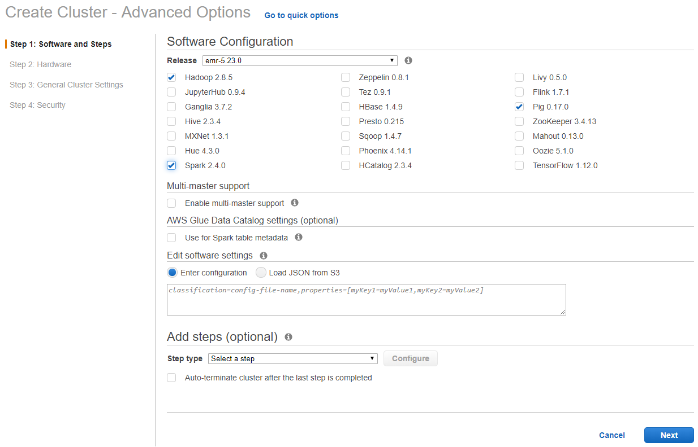
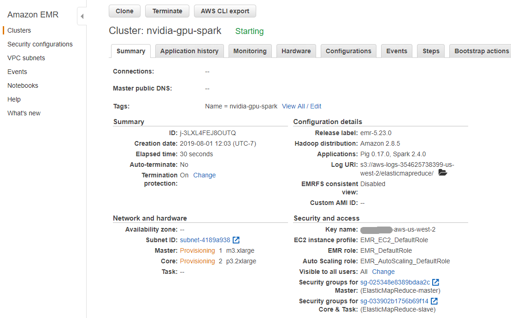
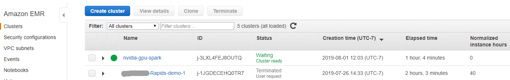
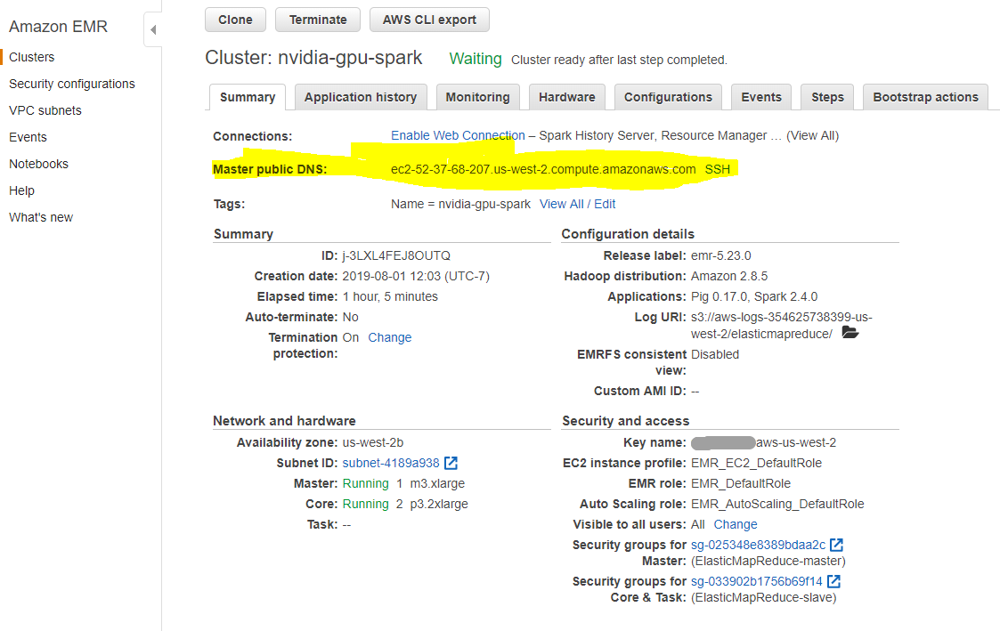

# Get Started with XGBoost4J-Spark on AWS EMR

This is a getting started guide for XGBoost4J-Spark on AWS EMR. At the end of this guide, the user will be able to run a sample Apache Spark application that runs on NVIDIA GPUs on AWS EMR.

For more information on AWS EMR, please see the [AWS documentation](https://docs.aws.amazon.com/emr/latest/ManagementGuide/emr-what-is-emr.html).

### Configure and Launch AWS EMR with GPU Nodes

Go to the AWS Management Console and select the `EMR` service from the "Analytics" section. Choose the region you want to launch your cluster in, e.g. US West Oregon, using the dropdown menu in the top right corner. Click `Create cluster` and select `Go to advanced options`, which will bring up a detailed cluster configuration page.

##### Step 1:  Software and Steps

Select **emr-5.27.0** or latest EMR version for the release, uncheck all the software options, and then check **Hadoop 2.8.5** and **Spark 2.4.4**.  (Any EMR version that supports Spark 2.3 or above will work).

In the "Edit software settings" field, add the following snippet to disable Spark Dynamic Allocation by default: `[{"classification":"spark-defaults","properties":{"spark.dynamicAllocation.enabled":"false"}}]`



##### Step 2: Hardware

Select the desired VPC and availability zone in the "Network" and "EC2 Subnet" fields respectively. (Default network and subnet are ok)

In the "Core" node row, change the "Instance type" to **g4dn.xlarge**, **g4dn.2xlarge**, or **p3.2xlarge** and ensure "Instance count" is set to **2**. Keep the default "Master" node instance type of **m5.xlarge** and ignore the unnecessary "Task" node configuration.


##### Step 3:  General Cluster Settings

Enter a custom "Cluster name" and make a note of the s3 folder that cluster logs will be written to.

*Optionally* add key-value "Tags", configure a "Custom AMI", or add custom "Bootstrap Actions"  for the EMR cluster on this page.


#####  Step 4: Security

Select an existing "EC2 key pair" that will be used to authenticate SSH access to the cluster's nodes. If you do not have access to an EC2 key pair, follow these instructions to [create an EC2 key pair](https://docs.aws.amazon.com/AWSEC2/latest/UserGuide/ec2-key-pairs.html#having-ec2-create-your-key-pair).

*Optionally* set custom security groups in the "EC2 security groups" tab.

In the "EC2 security groups" tab, confirm that the security group chosen for the "Master" node allows for SSH access. Follow these instructions to [allow inbound SSH traffic](https://docs.aws.amazon.com/AWSEC2/latest/UserGuide/authorizing-access-to-an-instance.html) if the security group does not allow it yet.


##### Finish Cluster Configuration

The EMR cluster management page displays the status of multiple clusters or detailed information about a chosen cluster. In the detailed cluster view, the "Summary" and "Hardware" tabs can be used to monitor the status of master and core nodes as they provision and initialize.



When the cluster is ready, a green-dot will appear next to the cluster name and the "Status" column will display **Waiting, cluster ready**.



In the cluster's "Summary" tab, find the "Master public DNS" field and click the `SSH` button. Follow the instructions to SSH to the new cluster's master node.




#####  Above Cluster can also be built using AWS CLI

For g4dn.xlarge
```
aws emr create-cluster --termination-protected --applications Name=Hadoop Name=Spark --tags 'name=nvidia-gpu-spark' --ec2-attributes '{"KeyName":"your-key-name","InstanceProfile":"EMR_EC2_DefaultRole","SubnetId":"your-subnet-ID","EmrManagedSlaveSecurityGroup":"your-EMR-slave-security-group-ID","EmrManagedMasterSecurityGroup":"your-EMR-master-security-group-ID"}' --release-label emr-5.30.0-preview --log-uri 's3n://your-s3-bucket/elasticmapreduce/' --instance-groups '[{"InstanceCount":2,"InstanceGroupType":"CORE","InstanceType":"g4dn.xlarge","Name":"Core - 2"},{"InstanceCount":1,"EbsConfiguration":{"EbsBlockDeviceConfigs":[{"VolumeSpecification":{"SizeInGB":32,"VolumeType":"gp2"},"VolumesPerInstance":2}]},"InstanceGroupType":"MASTER","InstanceType":"m5.xlarge","Name":"Master - 1"}]' --configurations '[{"Classification":"spark-defaults","Properties":{"spark.dynamicAllocation.enabled":"false"}}]' --auto-scaling-role EMR_AutoScaling_DefaultRole --ebs-root-volume-size 10 --service-role EMR_DefaultRole --enable-debugging --name 'nvidia-gpu-spark' --scale-down-behavior TERMINATE_AT_TASK_COMPLETION --region us-east-1
```


For P3.2xlarge
```
aws emr create-cluster --termination-protected --applications Name=Hadoop Name=Spark --tags 'Name=nvidia-gpu-spark' --ec2-attributes '{"KeyName":"your-key-name","InstanceProfile":"EMR_EC2_DefaultRole","SubnetId":"your-subnet-ID","EmrManagedSlaveSecurityGroup":"your-EMR-slave-security-group-ID","EmrManagedMasterSecurityGroup":"your-EMR-master-security-group-ID"}' --release-label emr-5.27.0 --log-uri 's3n://your-s3-bucket/elasticmapreduce/' --instance-groups '[{"InstanceCount":1,"EbsConfiguration":{"EbsBlockDeviceConfigs":[{"VolumeSpecification":{"SizeInGB":32,"VolumeType":"gp2"},"VolumesPerInstance":2}]},"InstanceGroupType":"MASTER","InstanceType":"m5.xlarge","Name":"Master - 1"},{"InstanceCount":2,"EbsConfiguration":{"EbsBlockDeviceConfigs":[{"VolumeSpecification":{"SizeInGB":32,"VolumeType":"gp2"},"VolumesPerInstance":4}]},"InstanceGroupType":"CORE","InstanceType":"p3.2xlarge","Name":"Core - 2"}]' --configurations '[{"Classification":"spark-defaults","Properties":{"spark.dynamicAllocation.enabled":"false"}}]' --auto-scaling-role EMR_AutoScaling_DefaultRole --ebs-root-volume-size 10 --service-role EMR_DefaultRole --enable-debugging --name 'nvidia-gpu-spark' --scale-down-behavior TERMINATE_AT_TASK_COMPLETION --region us-west-2
```
Fill with actual value for KeyName, SubnetId, EmrManagedSlaveSecurityGroup, EmrManagedMasterSecurityGroup, S3 bucket for logs, name and region.


### Build and Execute XGBoost-Spark examples on EMR

SSH to the EMR cluster's master node and run the following steps to setup, build, and run the XGBoost-Spark examples.

#### Install git and maven

```
sudo yum update -y
sudo yum install git -y
wget http://apache.mirrors.lucidnetworks.net/maven/maven-3/3.6.3/binaries/apache-maven-3.6.3-bin.zip
unzip apache-maven-3.6.3-bin.zip
export PATH=/home/hadoop/apache-maven-3.6.3/bin:$PATH
mvn --version
```

#### Build Example Jars

```
git clone https://github.com/rapidsai/spark-examples.git
pushd spark-examples/examples/apps/scala
mvn package #CUDA 9.2 build command
popd
```

The `mvn package` command may require additional configuration depending on the CUDA version of the chosen EMR instance images. For detailed build instructions including different CUDA versions, see [Build XGBoost Scala Examples](/getting-started-guides/building-sample-apps/scala.md).

#### Fetch the Mortgage Dataset

```
mkdir data
pushd data
wget https://rapidsai-data.s3.us-east-2.amazonaws.com/spark/mortgage.zip
unzip mortgage.zip
popd
```

#### Upload Data and Jar files to HDFS

```
hadoop fs -mkdir -p /tmp/xgboost4j_spark/data
hadoop fs -copyFromLocal ~/spark-examples/examples/apps/scala/target/*.jar /tmp/xgboost4j_spark
hadoop fs -copyFromLocal ~/data/* /tmp/xgboost4j_spark/data
```

#### Launch the GPU Mortgage Example

```
# location where data was downloaded
export DATA_PATH=hdfs:/tmp/xgboost4j_spark/data
# location for the required jar
export JARS_PATH=hdfs:/tmp/xgboost4j_spark
# spark deploy mode (see Apache Spark documentation for more information)
export SPARK_DEPLOY_MODE=client
# run a single executor for this example to limit the number of spark tasks and
# partitions to 1 as currently this number must match the number of input files
export SPARK_NUM_EXECUTORS=2
# spark driver memory
export SPARK_DRIVER_MEMORY=4g
# spark executor memory
export SPARK_EXECUTOR_MEMORY=8g
# example class to use
export EXAMPLE_CLASS=ai.rapids.spark.examples.mortgage.GPUMain
# XGBoost4J example jar
export JAR_EXAMPLE=${JARS_PATH}/sample_xgboost_apps-0.1.5-jar-with-dependencies.jar
# tree construction algorithm
export TREE_METHOD=gpu_hist


spark-submit                                                                    \
 --master yarn                                                                  \
 --deploy-mode ${SPARK_DEPLOY_MODE}                                             \
 --num-executors ${SPARK_NUM_EXECUTORS}                                         \
 --driver-memory ${SPARK_DRIVER_MEMORY}                                         \
 --executor-memory ${SPARK_EXECUTOR_MEMORY}                                     \
 --conf spark.executor.cores=4 --conf spark.task.cpus=4                         \
 --class ${EXAMPLE_CLASS}                                                       \
 ${JAR_EXAMPLE}                                                                 \
 -trainDataPath=${DATA_PATH}/mortgage/csv/train/mortgage_train_merged.csv       \
 -evalDataPath=${DATA_PATH}/mortgage/csv/test/mortgage_eval_merged.csv          \
 -format=csv                                                                    \
 -numWorkers=${SPARK_NUM_EXECUTORS}                                             \
 -treeMethod=${TREE_METHOD}                                                     \
 -numRound=100                                                                  \
 -maxDepth=8
```

Note: To maximize the SPARK excutor cores and task CPUs, use 4 for g4dn.xlarge, 8 for g4dn.2xlarge and 8 for P3.2xlarge.  


#### Review the results and benchmark

If using the client mode for spark deploy, you can view the results directly from master node. For example, the terminal output on master node has following lines for the benchmark using two g4dn.xlarge instances. 

```
...

--------------
==> Benchmark: Elapsed time for [Mortgage GPU train csv stub Unknown Unknown Unknown]: 23.48s
--------------
...

--------------
==> Benchmark: Elapsed time for [Mortgage GPU transform csv stub Unknown Unknown Unknown]: 11.761s
--------------
...

+------------+----------------+------------+-------------+----------------+--------------+------------+-----------------------------+-----------+--------+------------------+--------+--------------+--------+---------+-------------+----+---------------------+---------+-----+--------------------------+-------------------------------+------------------+-------------+--------+-------+------------------------+--------------+--------------------+--------------------+----------+
|orig_channel|first_home_buyer|loan_purpose|property_type|occupancy_status|property_state|product_type|relocation_mortgage_indicator|seller_name|mod_flag|orig_interest_rate|orig_upb|orig_loan_term|orig_ltv|orig_cltv|num_borrowers| dti|borrower_credit_score|num_units|  zip|mortgage_insurance_percent|current_loan_delinquency_status|current_actual_upb|interest_rate|loan_age|    msa|non_interest_bearing_upb|delinquency_12|       rawPrediction|         probability|prediction|
+------------+----------------+------------+-------------+----------------+--------------+------------+-----------------------------+-----------+--------+------------------+--------+--------------+--------+---------+-------------+----+---------------------+---------+-----+--------------------------+-------------------------------+------------------+-------------+--------+-------+------------------------+--------------+--------------------+--------------------+----------+
|         0.0|             0.0|         0.0|          0.0|             0.0|           0.0|         0.0|                          0.0|        0.0|     0.0|         5.8500004| 77000.0|         360.0|    90.0|      0.0|          1.0|35.0|                773.0|      1.0|752.0|                      25.0|                            0.0|               0.0|    5.8500004|     8.0|19100.0|                     0.0|           0.0|[7.06611537933349...|[0.99914718553191...|       0.0|
|         0.0|             0.0|         0.0|          0.0|             0.0|           0.0|         0.0|                          0.0|        0.0|     0.0|         5.8500004| 77000.0|         360.0|    90.0|      0.0|          1.0|35.0|                773.0|      1.0|752.0|                      25.0|                            0.0|          56173.95|    5.8500004|   138.0|19100.0|                     0.0|           0.0|[4.60780715942382...|[0.99012482631951...|       0.0|
|         0.0|             0.0|         0.0|          0.0|             0.0|           0.0|         0.0|                          0.0|        0.0|     0.0|         5.8500004| 77000.0|         360.0|    90.0|      0.0|          1.0|35.0|                773.0|      1.0|752.0|                      25.0|                            0.0|          56858.73|    5.8500004|   135.0|19100.0|                     0.0|           0.0|[4.60780715942382...|[0.99012482631951...|       0.0|
|         0.0|             0.0|         0.0|          0.0|             0.0|           0.0|         0.0|                          0.0|        0.0|     0.0|         5.8500004| 77000.0|         360.0|    90.0|      0.0|          1.0|35.0|                773.0|      1.0|752.0|                      25.0|                            0.0|          60971.25|    5.8500004|   116.0|19100.0|                     0.0|           0.0|[4.60780715942382...|[0.99012482631951...|       0.0|
|         0.0|             0.0|         0.0|          0.0|             0.0|           0.0|         0.0|                          0.0|        0.0|     0.0|         5.8500004| 77000.0|         360.0|    90.0|      0.0|          1.0|35.0|                773.0|      1.0|752.0|                      25.0|                            0.0|         61379.633|    5.8500004|   114.0|19100.0|                     0.0|           0.0|[4.60780715942382...|[0.99012482631951...|       0.0|
+------------+----------------+------------+-------------+----------------+--------------+------------+-----------------------------+-----------+--------+------------------+--------+--------------+--------+---------+-------------+----+---------------------+---------+-----+--------------------------+-------------------------------+------------------+-------------+--------+-------+------------------------+--------------+--------------------+--------------------+----------+
only showing top 5 rows

...
--------------
==> Benchmark: Accuracy for [Mortgage GPU Accuracy csv stub Unknown Unknown Unknown]: 0.9873847541002246
--------------
```

If using the cluster mode, you can view the results in SPARK  driver's logs. Retrieve the Spark driver's logs from the EMR cluster's "Application history" tab. Select the completed mortgage example's ID from the "Application ID" column and then select the "Executors" tab. In the **driver** row, click on `View logs` then `stdout`. The stdout log file contains time metrics and RMSE accuracy metrics.


