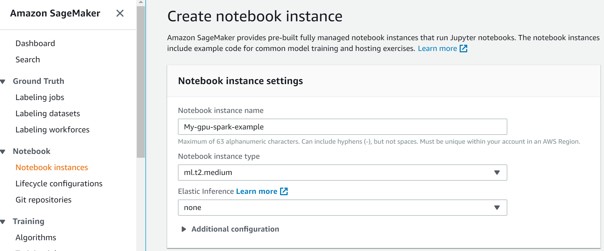
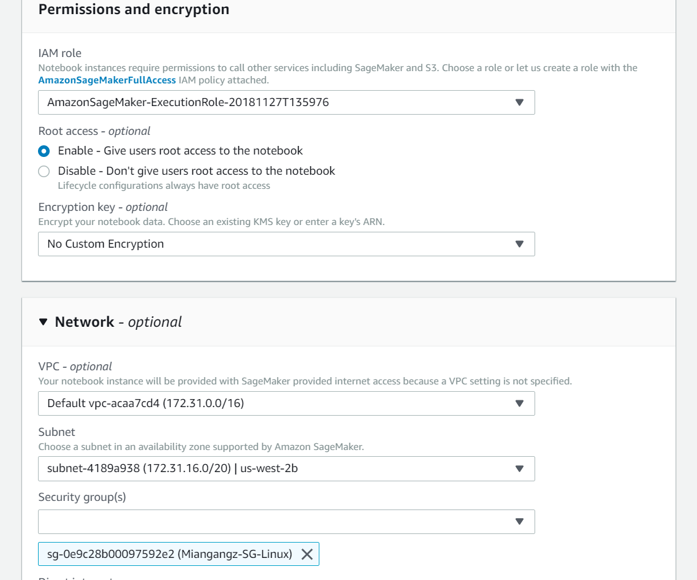
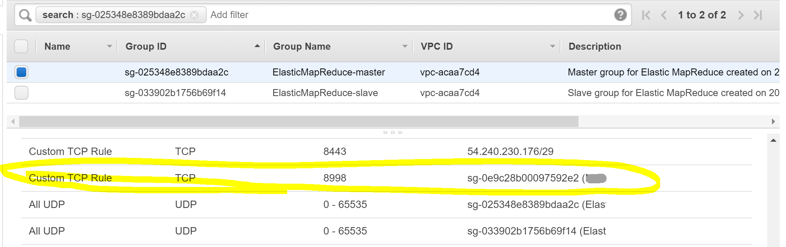
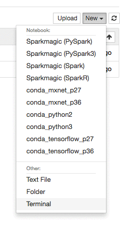
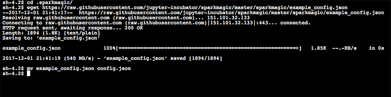
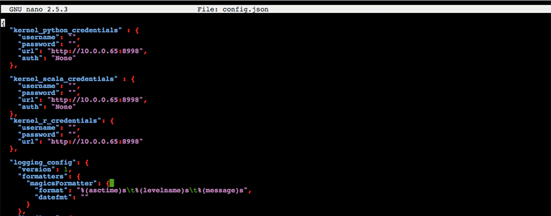
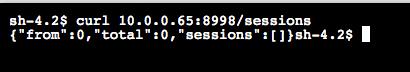
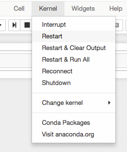
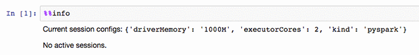
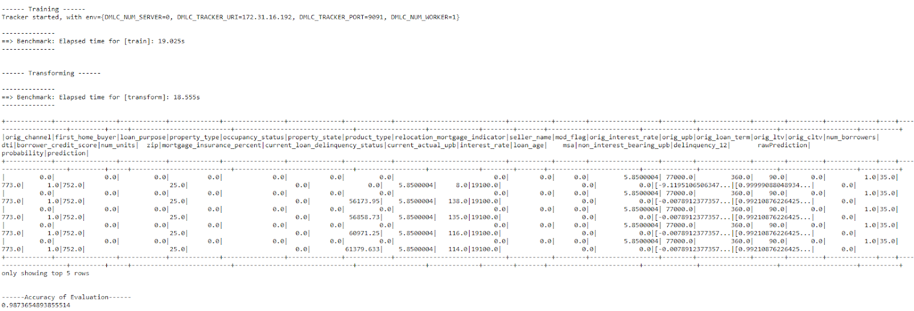

# Get Started with XGBoost4J-Spark on AWS SageMaker

This is a getting started guide to XGBoost4J-Spark on AWS SageMaker. At the end of this guide, the reader will be able to run a sample Apache Spark application that runs on NVIDIA GPUs on AWS SageMaker.

### Configure and Launch AWS EMR with GPU Nodes

Please follow [this guide](emr.md#configure-and-launch-aws-emr-with-gpu-nodes) to configure and launch AWS EMR with GPU Nodes.

### Launch XGBoost-Spark Examples on EMR

Last, let's follow this guide [Get Started with XGBoost4J-Spark on Apache Hadoop YARN](/getting-started-guides/on-premises-cluster/yarn-scala.md) to just upload data on Spark. (The other options is to put data on AWS S3 that can be accessed by Amazon SageMaker Notebook.)

First get dataset and then copy local data to HDFS.

```
mkdir data
cd data
wget https://rapidsai-data.s3.us-east-2.amazonaws.com/spark/mortgage.zip
unzip mortgage.zip
cd ..
hadoop fs -mkdir /tmp/xgboost4j_spark
hadoop fs -copyFromLocal * /tmp/xgboost4j_spark
```

### Launch SageMaker Notebook

Please follow the [AWS blog](https://aws.amazon.com/blogs/machine-learning/build-amazon-sagemaker-notebooks-backed-by-spark-in-amazon-emr/) for the steps to setup Spark Livy with EMR.

First launch a SageMaker Notebook Instance with default setting. In the network settings, please select the same VPC and Subnet where your EMR cluster is in and also select a security group for notebook instance.





Open the ports for Livy (TCP 8998)  in security group that EMR Master is using.



### Connect the Notebook to Amazon EMR

Now we have our EMR Spark cluster and our Amazon SageMaker notebook running, but they can’t talk to each other yet. The next step is to set up Sparkmagic in SageMaker so it knows how to find our EMR cluster.

While still in the Amazon SageMaker console, go to your Notebook Instances and choose Open on the instance that was provisioned.

Inside your Jupyter console, choose New and then Terminal.



Type the following commands:

```
cd .sparkmagic
wget https://raw.githubusercontent.com/jupyter-incubator/sparkmagic/master/sparkmagic/example_config.json
mv example_config.json config.json
```



Then you need to edit the config.json, and replace every instance of `localhost` with the Private IP of your EMR Master that you used earlier. Mine is 10.0.0.65, which we saw earlier, but yours will be different!

I used the following commands:

```
nano config.json
ctrl+\
localhost
<your EMR Master private IP>
a
ctrl+x
y
enter
```

This should replace three instances of localhost in the "url" field of the three kernel credentials. Feel free to use any editor you are comfortable with, and save the changes.



Before moving forward, we should test our connection to EMR over Livy. We can do that by running the following command (replace the EMR Master Private IP with the IP address of your instance):

```
curl <EMR Master Private IP>:8998/sessions
```

Your output should look like the following:



If you get an error, it likely means that your ports have not been opened in the security group, so I would recommend going back and checking those settings!

Let's close the terminal. Type exit and then close the browser tab with the terminal. Open the tab with Jupyter, and choose New and then Sparkmagic (Spark) to open a Spark notebook. Just to be sure, let's re-start the kernel by choosing Kernel and then Restart.



Let’s test the connection with the following command in the first cell:

```
%%info
```

Type shift and enter at the same time to run the cell, and you should see something like the following output:



You now have a Sparkmagic kernel running in your Jupyter notebook, talking to your EMR Spark cluster by using Livy.

### Run the Example on SageMaker Notebook

Now Launch the GPU Mortgage Example:

```
%%configure -f
{
    "driverMemory": "8000M",
    "driverCores": 2,
    "executorMemory": "16000M",
    "conf" : {"spark.executor.instances":2, "spark.executor.cores":8, "spark.task.cpus": 8, "spark.yarn.maxAppAttempts": 1, "spark.dynamicAllocation.enabled": false},
    "jars" : ["https://repo1.maven.org/maven2/ai/rapids/cudf/0.9.1/cudf-0.9.1.jar",
      "https://repo1.maven.org/maven2/ai/rapids/xgboost4j-spark_2.11/1.0.0-Beta2/xgboost4j-spark_2.11-1.0.0-Beta2.jar",
      "https://repo1.maven.org/maven2/ai/rapids/xgboost4j_2.11/1.0.0-Beta2/xgboost4j_2.11-1.0.0-Beta2.jar"]
}

sc.listJars.foreach(println)

object Benchmark {
  def time[R](phase: String)(block: => R): (R, Float) = {
    val t0 = System.currentTimeMillis
    val result = block // call-by-name
    val t1 = System.currentTimeMillis
    (result, (t1 - t0).toFloat / 1000)
  }
}

// Databricks notebook source
import org.apache.spark.sql.SparkSession
import org.apache.spark.ml.evaluation.RegressionEvaluator
import org.apache.spark.ml.evaluation.MulticlassClassificationEvaluator
import org.apache.spark.sql.types.{DoubleType, IntegerType, StructField, StructType}
import ml.dmlc.xgboost4j.scala.spark.{XGBoostClassifier, XGBoostClassificationModel}

// COMMAND ----------
val trainPath = "hdfs:/tmp/xgboost4j_spark/data/mortgage/csv/train/"
val evalPath  = "hdfs:/tmp/xgboost4j_spark/data/mortgage/csv/test/"

// COMMAND ----------
sc.listJars.foreach(println)

// COMMAND ----------
val spark = SparkSession.builder.appName("mortgage-gpu").getOrCreate

// COMMAND ----------
val dataReader = new GpuDataReader(spark)

// COMMAND ----------
val labelColName = "delinquency_12"

val schema = StructType(List(
    StructField("orig_channel", DoubleType),
    StructField("first_home_buyer", DoubleType),
    StructField("loan_purpose", DoubleType),
    StructField("property_type", DoubleType),
    StructField("occupancy_status", DoubleType),
    StructField("property_state", DoubleType),
    StructField("product_type", DoubleType),
    StructField("relocation_mortgage_indicator", DoubleType),
    StructField("seller_name", DoubleType),
    StructField("mod_flag", DoubleType),
    StructField("orig_interest_rate", DoubleType),
    StructField("orig_upb", IntegerType),
    StructField("orig_loan_term", IntegerType),
    StructField("orig_ltv", DoubleType),
    StructField("orig_cltv", DoubleType),
    StructField("num_borrowers", DoubleType),
    StructField("dti", DoubleType),
    StructField("borrower_credit_score", DoubleType),
    StructField("num_units", IntegerType),
    StructField("zip", IntegerType),
    StructField("mortgage_insurance_percent", DoubleType),
    StructField("current_loan_delinquency_status", IntegerType),
    StructField("current_actual_upb", DoubleType),
    StructField("interest_rate", DoubleType),
    StructField("loan_age", DoubleType),
    StructField("msa", DoubleType),
    StructField("non_interest_bearing_upb", DoubleType),
    StructField(labelColName, IntegerType)))

val commParamMap = Map(
    "eta" -> 0.1,
    "gamma" -> 0.1,
    "missing" -> 0.0,
    "max_depth" -> 10,
    "max_leaves" -> 256,
    "grow_policy" -> "depthwise",
    "min_child_weight" -> 30,
    "lambda" -> 1,
    "scale_pos_weight" -> 2,
    "subsample" -> 1,
    "nthread" -> 1,
    "num_round" -> 100,
    "num_workers" -> 1,
    "tree_method" -> "gpu_hist")

var (trainSet, evalSet) = {
  dataReader.option("header", true).schema(schema)
  (dataReader.csv(trainPath), dataReader.csv(evalPath))}

val featureNames = schema.filter(_.name != labelColName).map(_.name)

// COMMAND ----------
object Benchmark {
  def time[R](phase: String)(block: => R): (R, Float) = {
    val t0 = System.currentTimeMillis
    val result = block // call-by-name
    val t1 = System.currentTimeMillis
    println("==> Benchmark: Elapsed time for [" + phase + "]: " + ((t1 - t0).toFloat / 1000) + "s")
    (result, (t1 - t0).toFloat / 1000)
  }
}

// COMMAND ----------
val modelPath = "/tmp/model"
val xgbClassifier = new XGBoostClassifier(commParamMap).setLabelCol(labelColName).setFeaturesCols(featureNames)
println("\n------ Training ------")

val (model, _) = Benchmark.time("train") {
        xgbClassifier.fit(trainSet)
}
// Save model if modelPath exists
model.write.overwrite().save(modelPath)
val xgbClassificationModel = model

// COMMAND ----------
println("\n------ Transforming ------")
val (results, _) = Benchmark.time("transform") {
  xgbClassificationModel.transform(evalSet)
}
// results.show(10)

// COMMAND ----------
println("\n------Accuracy of Evaluation------")
val evaluator = new MulticlassClassificationEvaluator().setLabelCol(labelColName)
val accuracy = evaluator.evaluate(results)
println(accuracy)
```

In the notebook output, you should see the training, inference and accuracy metrics.


