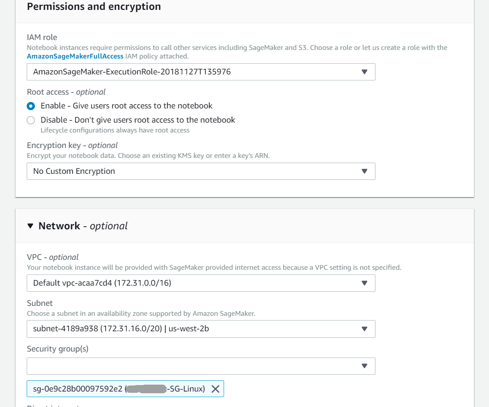

# Get Started with XGBoost4J-Spark on AWS SageMaker

This is a getting started guide for XGBoost4J-Spark on AWS SageMaker with AWS EMR. At the end of this guide, the user will be able to run a sample Apache Spark application that runs on NVIDIA GPUs on AWS SageMaker using an AWS EMR cluster.

### Configure and Launch an AWS EMR Cluster with GPUs

Follow the steps in [Getting Started with XGBoost4J-Spark on AWS EMR](emr.md#configure-and-launch-aws-emr-with-gpu-nodes) to configure and launch an AWS EMR cluster with GPU Nodes.

### Put Example Data on HDFS

This section duplicates instructions from the [fetch data](/getting-started-guides/csp/aws/emr.md#fetch-the-mortgage-dataset) and [upload to HDFS](/getting-started-guides/csp/aws/emr.md#upload-data-and-jars-files-to-hdfs) sections of the [Getting Started with XGBoost4J-Spark on AWS EMR](emr.md#configure-and-launch-aws-emr-with-gpu-nodes) guide. If the example application in that guide has already been ran successfully, this step can be skipped.

Execute the following commands while SSH'ed to the EMR Cluster's master node to download the dataset, unzip it, and push it to HDFS. See [this step](/getting-started-guides/csp/aws/emr.md#finish-cluster-configuration) for help SSH'ing to the EMR cluster.

```bash
mkdir data
pushd data
wget https://rapidsai-data.s3.us-east-2.amazonaws.com/spark/mortgage.zip
unzip mortgage.zip
popd
hadoop fs -mkdir /tmp/xgboost4j_spark/data
hadoop fs -copyFromLocal ~/data/* /tmp/xgboost4j_spark/data
```

### Launch and Connect SageMaker Notebook Instance

Set up Spark Livy with AWS SageMaker using a modified version of the instructions in this [AWS blog post](https://aws.amazon.com/blogs/machine-learning/build-amazon-sagemaker-notebooks-backed-by-spark-in-amazon-emr/).

#### Create an AWS VPC Security Group

In the AWS Management Console select the `VPC` service from the "Networking & Content Delivery" section. Select the `Security Groups` option from the left menu, then click the `Create security group` button.

Fill out the required fields and select an ID from the dropdown "VPC" menu before clicking `Create`. Take note of the newly created security group's "Group Name" and "Group ID" -- both values are needed in the next few steps.

#### Configure EMR Cluster's Security Group for Livy Access

From the VPC Dashboard's "Security Groups" page, click on the security group used by the EMR Cluster's master node. In the "Inbound Rules" tab, click on the `Edit rules` button and then `Add Rule`. Edit the new rule to match the image below, but set the custom source to the "Group ID" created in the [previous step](#create-an-aws-vpc-security-group).


#### Launch SageMaker Notebook Instance

In the AWS Management Console select the `Amazon SageMaker` service from the "Machine Learning" section. Confirm the region you're launching a instance in matches the region that you launched the EMR cluster in. Click on the `Notebook instances` button and then select `Create notebook instance` to bring up the instance configuration page.

Set a "Notebook instance name" and expand the "Network" configuration tab. Select a "VPC" and "Subnet" that match the EMR cluster's configuration. The "Subnet" information can be found in the EMR cluster's summary page and -- unless a custom VPC was configured -- select the VPC named **Default vpc-** followed by an organization specific unique id from the drop down menu.

Select the security group created in a [previous step](#create-an-aws-vpc-security-group) from the "Security group(s)" dropdown menu.

Leave all other settings as default.




#### Connect the Notebook to Amazon EMR

In the Amazon SageMaker console, click on the `Open Jupyter` button of the newly launched notebook instance.

Inside the Jupyter console, launch a CLI to configure the cluster from by choosing `New` and then `Terminal` as seen in the image below.


Execute the following commands to configure Sparkmagic in SageMaker so that the notebook cluster can find and connect to the EMR cluster.


```bash
cd .sparkmagic
wget https://raw.githubusercontent.com/jupyter-incubator/sparkmagic/master/sparkmagic/example_config.json
mv example_config.json config.json
```


The config.json file must be edited to replace every instance of `localhost` with the **Private IP of the EMR cluster's master node**. A node's private IP can be found in the EMR cluster's detailed view on the "Hardware" tab. Click on the "ID" of the master node and scroll all the way to the right. Edit then execute the following command, replacing `10.0.0.65` with the IP found in the "Private IP address" column.

```bash
sed -i 's/localhost/10.0.0.65/g' config.json
```

The resulting configuration file should look like:


#### Test Notebook Connection

Run the following command to test the connection from Livy to the EMR Cluster, replace the `<EMR Master Cluster Master Node Private IP>` with the IP address found in the previous step.

```bash
curl <EMR Cluster Master Node Private IP>:8998/sessions
```

The output should look like:


If there is an error, it likely means the ports have not been opened in the security group and those settings should be double checked!

Close the terminal by typing `exit` and then close the browser tab running the exited terminal. Return to the Jupyter console webpage, then choose `New` and `Sparkmagic (Spark)` to create a new Spark notebook. Restart the kernel by choosing `Kernel` and then `Restart` to ensure the Notebook kernel is connected to the EMR cluster.


Test the kernel with the following command in the first notebook cell:

```
%%info
```

Type shift and enter at the same time to run the cell, the cell should complete with similar output to the following image:


There is now a Sparkmagic kernel running inside the Jupyter notebook and talking to the EMR Spark cluster using Livy!


### Run the Example SageMaker Notebook

##### Cell 1 -- Configure the notebook session:

```
%%configure -f
{
    "driverMemory": "8000M",
    "driverCores": 2,
    "executorMemory": "16000M",
    "conf" : {"spark.executor.instances":2, "spark.executor.cores":8, "spark.task.cpus": 8, "spark.yarn.maxAppAttempts": 1, "spark.dynamicAllocation.enabled": false},
    "jars" : ["https://repo1.maven.org/maven2/ai/rapids/cudf/0.9.1/cudf-0.9.1.jar",
      "https://repo1.maven.org/maven2/ai/rapids/xgboost4j-spark_2.11/1.0.0-Beta2/xgboost4j-spark_2.11-1.0.0-Beta2.jar",
      "https://repo1.maven.org/maven2/ai/rapids/xgboost4j_2.11/1.0.0-Beta2/xgboost4j_2.11-1.0.0-Beta2.jar"]
}
```

##### Cell 2 -- Verify notebook configuration:

```
%%info
```

Use the session configuration information to double check that the configured session does not request resources that exceed the connected EMR cluster's actual resources.

##### Cell 3 -- Application code:
```scala
sc.listJars.foreach(println)

// import notebook source
import org.apache.spark.sql.SparkSession
import org.apache.spark.ml.evaluation.RegressionEvaluator
import org.apache.spark.ml.evaluation.MulticlassClassificationEvaluator
import org.apache.spark.sql.types.{DoubleType, IntegerType, StructField, StructType}
import ml.dmlc.xgboost4j.scala.spark.{XGBoostClassifier, XGBoostClassificationModel}
import ml.dmlc.xgboost4j.scala.spark.rapids.{GpuDataReader, GpuDataset}

// COMMAND ----------
val trainPath = "hdfs:/tmp/xgboost4j_spark/data/mortgage/csv/train/"
val evalPath  = "hdfs:/tmp/xgboost4j_spark/data/mortgage/csv/test/"

// COMMAND ----------
sc.listJars.foreach(println)

// COMMAND ----------
val spark = SparkSession.builder.appName("mortgage-gpu").getOrCreate

// COMMAND ----------
val dataReader = new GpuDataReader(spark)

// COMMAND ----------
val labelColName = "delinquency_12"

val schema = StructType(List(
    StructField("orig_channel", DoubleType),
    StructField("first_home_buyer", DoubleType),
    StructField("loan_purpose", DoubleType),
    StructField("property_type", DoubleType),
    StructField("occupancy_status", DoubleType),
    StructField("property_state", DoubleType),
    StructField("product_type", DoubleType),
    StructField("relocation_mortgage_indicator", DoubleType),
    StructField("seller_name", DoubleType),
    StructField("mod_flag", DoubleType),
    StructField("orig_interest_rate", DoubleType),
    StructField("orig_upb", IntegerType),
    StructField("orig_loan_term", IntegerType),
    StructField("orig_ltv", DoubleType),
    StructField("orig_cltv", DoubleType),
    StructField("num_borrowers", DoubleType),
    StructField("dti", DoubleType),
    StructField("borrower_credit_score", DoubleType),
    StructField("num_units", IntegerType),
    StructField("zip", IntegerType),
    StructField("mortgage_insurance_percent", DoubleType),
    StructField("current_loan_delinquency_status", IntegerType),
    StructField("current_actual_upb", DoubleType),
    StructField("interest_rate", DoubleType),
    StructField("loan_age", DoubleType),
    StructField("msa", DoubleType),
    StructField("non_interest_bearing_upb", DoubleType),
    StructField(labelColName, IntegerType)))

val commParamMap = Map(
    "eta" -> 0.1,
    "gamma" -> 0.1,
    "missing" -> 0.0,
    "max_depth" -> 10,
    "max_leaves" -> 256,
    "grow_policy" -> "depthwise",
    "min_child_weight" -> 30,
    "lambda" -> 1,
    "scale_pos_weight" -> 2,
    "subsample" -> 1,
    "nthread" -> 1,
    "num_round" -> 100,
    "num_workers" -> 1,
    "tree_method" -> "gpu_hist")

var (trainSet, evalSet) = {
  dataReader.option("header", true).schema(schema)
  (dataReader.csv(trainPath), dataReader.csv(evalPath))}

val featureNames = schema.filter(_.name != labelColName).map(_.name)

// COMMAND ----------
object Benchmark {
  def time[R](phase: String)(block: => R): (R, Float) = {
    val t0 = System.currentTimeMillis
    val result = block // call-by-name
    val t1 = System.currentTimeMillis
    println("==> Benchmark: Elapsed time for [" + phase + "]: " + ((t1 - t0).toFloat / 1000) + "s")
    (result, (t1 - t0).toFloat / 1000)
  }
}

// COMMAND ----------
val modelPath = "/tmp/model"
val xgbClassifier = new XGBoostClassifier(commParamMap).setLabelCol(labelColName).setFeaturesCols(featureNames)
println("\n------ Training ------")

val (model, _) = Benchmark.time("train") {
        xgbClassifier.fit(trainSet)
}
// Save model if modelPath exists
model.write.overwrite().save(modelPath)
val xgbClassificationModel = model

// COMMAND ----------
println("\n------ Transforming ------")
val (results, _) = Benchmark.time("transform") {
  xgbClassificationModel.transform(evalSet)
}
// results.show(10)

// COMMAND ----------
println("\n------Accuracy of Evaluation------")
val evaluator = new MulticlassClassificationEvaluator().setLabelCol(labelColName)
val accuracy = evaluator.evaluate(results)
println(accuracy)
```

Training, inference and accuracy metrics should be in the cell's output.

```
------ Training ------
==> Benchmark: Elapsed time for [train]: 21.6s

------ Transforming ------
==> Benchmark: Elapsed time for [transform]: 1.352s

------Accuracy of Evaluation------
accuracy: Double = 0.9875258447219547
```